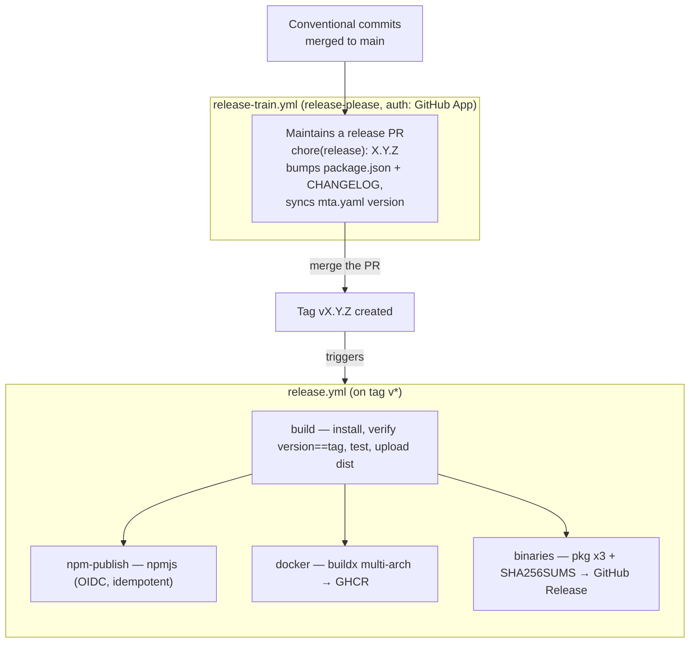

# Release guide (maintainers)

ROSA ships **one release per version, multi-artifact**: a single tag produces the
npm package (`@rosa-mcp/server` on npmjs, via Trusted Publishing), a multi-arch
Docker image on GHCR, and native executables on the GitHub Release. There is no
per-target release — one codebase, zero functional gap between modes.

- [Pipeline overview](#pipeline-overview)
- [The normal flow: the release train](#the-normal-flow-the-release-train)
- [The ship-guard](#the-ship-guard)
- [What the release workflow does](#what-the-release-workflow-does)
- [One-time setup (bootstrap)](#one-time-setup-bootstrap)
- [Manual fallback](#manual-fallback)
- [If a job fails mid-release](#if-a-job-fails-mid-release)

## Pipeline overview



## The normal flow: the release train

A release is **a merged PR, no local commands.**

1. Merge conventional-commit PRs into `main` (`feat:` → minor, `fix:` → patch,
   `feat!:`/`BREAKING CHANGE` → major). Only `feat`, `fix` and breaking changes
   cut a release; `chore`, `docs`, `ci`, `refactor`, etc. do not.
2. [`release-train.yml`](../.github/workflows/release-train.yml) runs
   [release-please](https://github.com/googleapis/release-please) on each push to
   `main` and maintains a rolling **`chore(release): X.Y.Z`** PR that bumps
   `package.json`, updates `CHANGELOG.md`, and syncs the version in `mta.yaml`
   (via the `# x-release-please-version` annotation on its `version:` line).
3. **Merge that PR.** release-please tags `vX.Y.Z` and creates the GitHub Release.
4. The tag triggers [`release.yml`](../.github/workflows/release.yml) — the four
   jobs below run and attach all artifacts.

Config lives in [`release-please-config.json`](../release-please-config.json) and
[`.release-please-manifest.json`](../.release-please-manifest.json).

> **Auth: a GitHub App, not a PAT.** A tag created with the default
> `GITHUB_TOKEN` does **not** trigger other workflows (GitHub anti-recursion), so
> the train authenticates as a **GitHub App** whose token *does* trigger
> `release.yml` — and, unlike a PAT, never expires. Set the repo **variable**
> `RELEASE_APP_ID` and the **secret** `RELEASE_APP_PRIVATE_KEY` (see
> [bootstrap](#one-time-setup-bootstrap)). While `RELEASE_APP_ID` is unset the
> train falls back to `github.token`, which still maintains the release PR but
> won't trigger `release.yml` — start it manually then (see
> [manual fallback](#manual-fallback)).

### `sync-version.js` (manual bumps)

The train keeps `mta.yaml` in sync itself. For an exceptional **manual** bump,
`npm version <patch|minor|major>` runs [`scripts/sync-version.js`](../scripts/sync-version.js)
via the npm `version` hook, propagating the new version to `mta.yaml` and the
README `_X.Y.Z.mtar` references. (The server version itself is no longer a
hard-coded literal: `dist/` reads `package.json` and the bundle/binaries get it
from an esbuild `define` — see [`esbuild.config.mjs`](../esbuild.config.mjs).)

## The ship-guard

A PR that changes what ROSA **ships** must be releasable, so a change — most often
a Dependabot dependency bump — can never merge and then be silently left
unreleased. [`scripts/require-release.mjs`](../scripts/require-release.mjs) runs
on every PR (the `guard` job in [`ci.yml`](../.github/workflows/ci.yml)) and fails
unless a releasable commit (`feat` / `fix` / breaking) is present.

**Shipped** = non-test files under `src/**`, `sap_abbreviation_dictionary.json`,
runtime dependency ranges in `package.json`, any version change in the production
closure of `package-lock.json`, or the `Dockerfile` (helpers + tests in
[`scripts/lib/shipped-deps.mjs`](../scripts/lib/shipped-deps.mjs)).

- **Dependabot** production bumps are prefixed `fix(deps)` (a `fix` → releasable),
  dev-only bumps `chore(dev-deps)` (never shipped, so never required to release);
  groups are split by dependency-type so the prefix is unambiguous.
- **Escape hatch:** to merge a shipped change *without* releasing it, add the
  **`no-release`** label to the PR. The guard then passes with a loud note.

## What the release workflow does

`release.yml` (trigger: tags `v*`) has four jobs:

1. **build** (gate) — `npm ci`, then **fail if `package.json` version ≠ tag**
   (anti-drift), `npm run build`, `npm test`, upload `dist/`. Nothing publishes
   unless this passes.
2. **npm-publish** — publishes `@rosa-mcp/server` to **npmjs** via **Trusted
   Publishing (OIDC)** — no npm token; needs `id-token: write` and npm ≥ 11.5 (the
   job upgrades npm), provenance attached automatically. **Idempotent:** it skips
   `npm publish` if that version is already on npm.
3. **docker** — buildx + QEMU multi-arch (`linux/amd64`, `linux/arm64`) push to
   `ghcr.io/clementringot/rosa`, tagged `{version}`, `{major}.{minor}`, `latest`.
4. **binaries** — cross-compiles the three native executables, writes
   `SHA256SUMS.txt`, and creates the GitHub Release with auto-generated notes.

## One-time setup (bootstrap)

### 1. First npm publish + Trusted Publisher

npmjs can only configure a Trusted Publisher for a package that **already
exists**, so the very first publish is manual:

```bash
# with a short-lived, granular npm automation token (delete it right after)
npm publish --access public
```

Then on npmjs.com → the package → **Settings → Trusted Publisher** → add a
**GitHub Actions** publisher:

- Repository: `ClementRingot/ROSA`
- Workflow: `release.yml`

Delete the temporary token. From then on `release.yml` publishes with **no
token** (OIDC). The `@rosa-mcp` npm org/scope must exist (create it on npmjs, or
it is created with the first scoped publish if the name is available).

### 2. GHCR image visibility

The GHCR container image is **private by default** — make it public once:
org/user **Packages → `rosa` (container) → Package settings → Change visibility →
Public.** (The npmjs package is public via `publishConfig.access=public`.)

### 3. Release-train GitHub App

Create a **GitHub App** (Settings → Developer settings → GitHub Apps) with
permissions **Contents: RW, Pull requests: RW, Issues: RW** (labels) and no
webhook; install it on this repo. Then set:

- repo **variable** `RELEASE_APP_ID` — the App's numeric ID;
- repo **secret** `RELEASE_APP_PRIVATE_KEY` — a generated `.pem` private key.

The train mints a short-lived token from these on each run
(`actions/create-github-app-token`), so the tag it pushes triggers `release.yml`.
No PAT, nothing to rotate.

## Manual fallback

If the App isn't configured (or you want to cut a release by hand):

```bash
npm version patch        # bumps package.json, runs sync-version.js, commits, tags
git push origin main --follow-tags
```

Pushing the `vX.Y.Z` tag triggers `release.yml`. If a tag was created by the
train's `github.token` fallback and didn't trigger the workflow, re-push it or
start `release.yml` from the Actions tab (Run workflow on the tag ref).

## If a job fails mid-release

The four jobs are independent after the `build` gate, so a partial release is
possible (e.g. npm published but Docker failed). **Just re-run the failed job**
from the Actions run:

- **npm-publish** is idempotent — a re-run skips the publish if the version is
  already on npm (so re-running the whole workflow is safe).
- **docker** and **binaries** overwrite their tags / release assets.
- **Wrong version tagged** — delete the tag and Release, fix `package.json` (the
  `build` gate fails on a mismatch anyway), and re-tag:
  ```bash
  git push --delete origin vX.Y.Z
  # fix, re-tag, push
  ```
