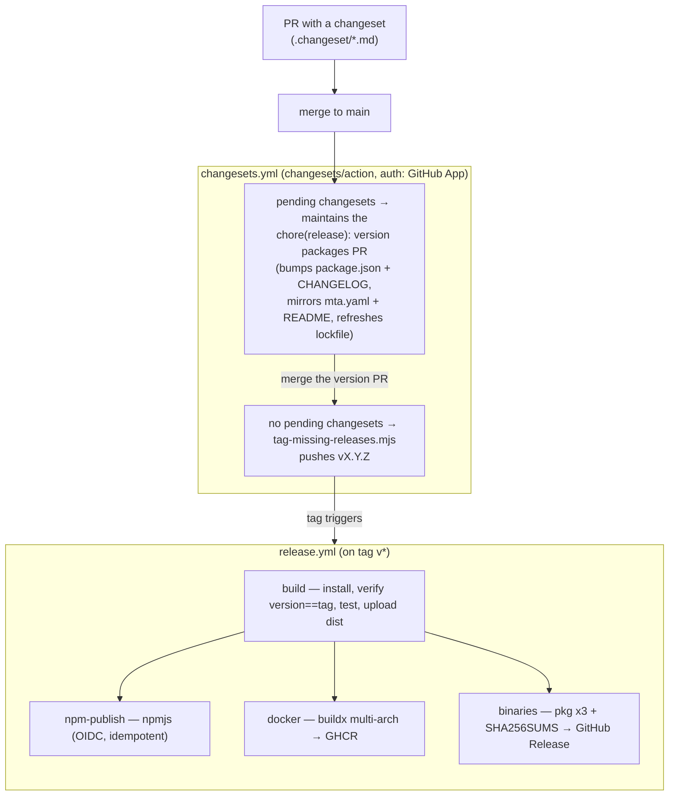

# Release guide (maintainers)

ROSA ships **one release per version, multi-artifact**: a single tag produces the
npm package (`@rosa-mcp/server` on npmjs, via Trusted Publishing), a multi-arch
Docker image on GHCR, and native executables on the GitHub Release. Releases are
driven by [Changesets](https://github.com/changesets/changesets) — the same
mechanism as [`ClementRingot/LISA`](https://github.com/ClementRingot/LISA).

- [Pipeline overview](#pipeline-overview)
- [The normal flow](#the-normal-flow)
- [The changeset guard](#the-changeset-guard)
- [What the release workflow does](#what-the-release-workflow-does)
- [One-time setup (bootstrap)](#one-time-setup-bootstrap)
- [Manual fallback](#manual-fallback)
- [If a job fails mid-release](#if-a-job-fails-mid-release)

## Pipeline overview



## The normal flow

A release is **a changeset plus two PR merges, no local release commands.**

1. Every PR that changes shipped code includes a **changeset** (`npx changeset`)
   describing the change and its bump level (patch/minor/major). The
   [`guard`](#the-changeset-guard) CI check enforces this.
2. On each push to `main`, [`changesets.yml`](../.github/workflows/changesets.yml)
   runs [`changesets/action`](https://github.com/changesets/action):
   - **pending changesets** → it opens/updates a **`chore(release): version
     packages`** PR that runs `npm run changeset:version` (bumps `package.json`,
     writes `CHANGELOG.md`, mirrors `mta.yaml` + the README `_X.Y.Z.mtar`
     references, and refreshes `package-lock.json`).
   - **no pending changesets** (right after that PR merges) → it runs
     [`scripts/tag-missing-releases.mjs`](../scripts/tag-missing-releases.mjs),
     which pushes the canonical **`vX.Y.Z`** tag for the committed version.
3. The pushed tag triggers [`release.yml`](../.github/workflows/release.yml) — the
   four jobs below build and publish all artifacts.

So the only human steps are **merging the PR** and **merging the version PR**.

> **Auth: a GitHub App, not a PAT.** A tag pushed with the default `GITHUB_TOKEN`
> does not trigger other workflows (GitHub anti-recursion), so the Changesets
> workflow authenticates as a **GitHub App** whose token *does* trigger
> `release.yml` — and never expires. Set the repo **variable** `RELEASE_APP_ID`
> and **secret** `RELEASE_APP_PRIVATE_KEY` (see [bootstrap](#one-time-setup-bootstrap)).
> While `RELEASE_APP_ID` is unset it falls back to `github.token`: the version PR
> still works, but a tag it pushes won't trigger `release.yml` — start it manually
> then (see [manual fallback](#manual-fallback)).

## The changeset guard

A PR that changes what ROSA **ships** must carry a changeset, so a version bump
can never be silently forgotten — most often a Dependabot dependency bump.
[`scripts/require-changeset.mjs`](../scripts/require-changeset.mjs) runs on every
PR (the `guard` job in [`ci.yml`](../.github/workflows/ci.yml)).

**Shipped** = non-test files under `src/**`, `sap_abbreviation_dictionary.json`,
runtime dependency ranges in `package.json`, any version change in the production
closure of `package-lock.json`, or the `Dockerfile` (helpers + tests in
[`scripts/lib/shipped-deps.mjs`](../scripts/lib/shipped-deps.mjs)).

- Add a changeset: `npx changeset` (pick the bump level).
- **Escape hatch:** to merge a shipped change *without* releasing it, add an
  **empty** changeset: `npx changeset add --empty`. The guard passes with a note.
- Dependabot PRs that touch shipped deps therefore need a changeset added by hand
  (or an empty one) before they can merge — the deliberate trade-off that stops a
  dependency bump from shipping unreleased.

## What the release workflow does

`release.yml` (trigger: tags `v*`) has four jobs:

1. **build** (gate) — `npm ci`, **fail if `package.json` version ≠ tag**, build,
   test, upload `dist/`. Nothing publishes unless this passes.
2. **npm-publish** — publishes `@rosa-mcp/server` to **npmjs** via **Trusted
   Publishing (OIDC)** — no token; provenance attached. **Idempotent:** it skips
   `npm publish` if that version is already on npm.
3. **docker** — buildx + QEMU multi-arch (`linux/amd64`, `linux/arm64`) → GHCR,
   tagged `{version}`, `{major}.{minor}`, `latest`.
4. **binaries** — cross-compiles the three native executables, writes
   `SHA256SUMS.txt`, and creates the GitHub Release with auto-generated notes.

## One-time setup (bootstrap)

### 1. First npm publish + Trusted Publisher

npmjs can only configure a Trusted Publisher for a package that **already
exists**, so the first publish is manual:

```bash
npm publish --access public   # with a short-lived granular token, deleted right after
```

Then on npmjs.com → the package → **Settings → Trusted Publisher** → add a
**GitHub Actions** publisher: repository `ClementRingot/ROSA`, workflow
`release.yml`. Delete the token. The `@rosa-mcp` npm org/scope must exist.

### 2. GHCR image visibility

The GHCR container image is private by default — make it public once: org/user
**Packages → `rosa` (container) → Package settings → Change visibility → Public.**
(The npmjs package is public via `publishConfig.access=public`.)

### 3. Release GitHub App

Create/reuse a **GitHub App** (Settings → Developer settings → GitHub Apps) with
**Contents: RW** and **Pull requests: RW**, no webhook; install it on this repo.
Then set the repo **variable** `RELEASE_APP_ID` (numeric App ID) and **secret**
`RELEASE_APP_PRIVATE_KEY` (a generated `.pem`). The same App can serve LISA and
ROSA. No PAT, nothing to rotate.

## Manual fallback

If the App isn't configured (or to cut a release by hand):

```bash
npm run changeset:version    # applies pending changesets: bump + CHANGELOG + mirrors
git commit -am "chore(release): version packages" && git push
git tag -a v$(node -p "require('./package.json').version") -m "vX.Y.Z"
git push origin --tags       # pushing as your user triggers release.yml
```

If a tag was created by the workflow's `github.token` fallback and didn't trigger
`release.yml`, re-push it locally (a push from your account triggers it).

## If a job fails mid-release

The four jobs are independent after the `build` gate, so a partial release is
possible. **Re-run the failed job** from the Actions run:

- **npm-publish** is idempotent — a re-run skips publish if the version is already
  on npm (so re-running the whole workflow is safe).
- **docker** and **binaries** overwrite their tags / release assets.
- **Wrong version tagged** — delete the tag and Release, fix, and re-tag:
  ```bash
  git push --delete origin vX.Y.Z
  ```
